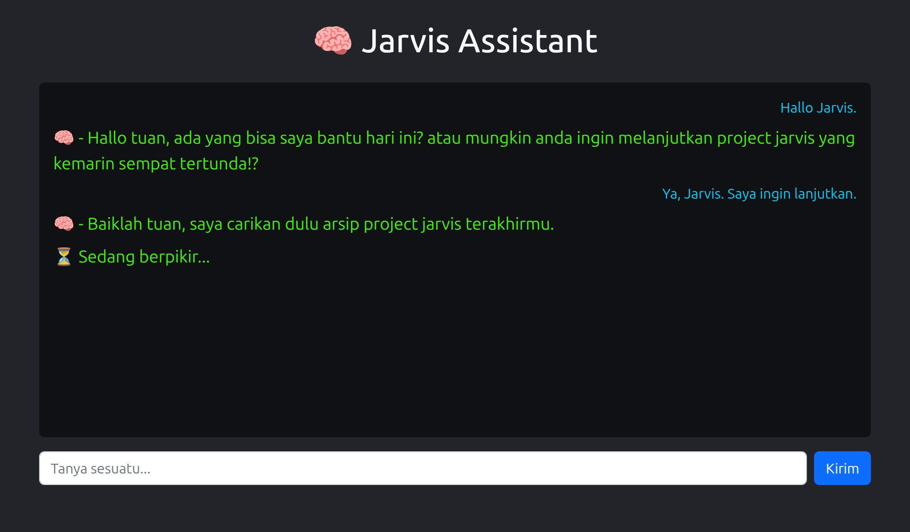

## 🧭 Roadmap: Asisten AI ala Jarvis (Versi Realistis)

### 🧱 Fase 1 – Pondasi Dasar

* Tujuan: Bangun backend sederhana pakai **GPT-4 API** untuk jadi otak si **"Jarvis"**.

[DEMO Jarvis ChatVersion](https://jarvischat.pages.dev)

| Jarvis CLI |
|-----------------|
|  |

**Langkah:**
- Setup akun OpenAI API
- Bikin server backend (Node.js atau Python FastAPI)
- Koneksi ke GPT-4 API
- Buat endpoint /ask untuk tanya jawab
- Integrasi antarmuka (Web, atau BotTelegram)

```pgsql
jarvis-dashboard/
├── public/
│   ├── index.html (jekyll generate)
│   └── style.css
├── server/
│   └── index.js
├── .env
└── package.json
```

### ⚙️ Contoh Kode Awal (Node.js + Express + GPT-4 API)

`install depensi`
```bash
npm init -y
npm install express axios dotenv
```

`.env`
```env
OPENAI_API_KEY=sk-xxxxxxxxxxxxxxxxxxxxxxxxxxxxxxxxxxxx
```

`index.js`
```js
const express = require('express');
const axios = require('axios');
require('dotenv').config();

const app = express();
app.use(express.json());

const GPT_ENDPOINT = 'https://api.openai.com/v1/chat/completions';

app.post('/ask', async (req, res) => {
  const userMessage = req.body.message;

  try {
    const response = await axios.post(
      GPT_ENDPOINT,
      {
        model: 'gpt-4o',
        messages: [{ role: 'user', content: userMessage }],
      },
      {
        headers: {
          'Authorization': `Bearer ${process.env.OPENAI_API_KEY}`,
          'Content-Type': 'application/json',
        },
      }
    );

    const reply = response.data.choices[0].message.content;
    res.json({ reply });
  } catch (error) {
    console.error(error?.response?.data || error.message);
    res.status(500).json({ error: 'Something went wrong' });
  }
});

app.listen(3000, () => {
  console.log('🧠 AI server berjalan di http://localhost:3000');
});
```

### 🔗 Fase 2 – Integrasi Antarmuka

- Web dashboard (pakai Bootstrap + Jekyll)
- CLI interface (langsung ngetik di terminal)
- Telegram bot (cocok untuk mobilitas)
- Voice input (pakai Whisper atau Google STT)

### 🧠 assets/js/script.js
```js
const form = document.getElementById("chat-form");
const input = document.getElementById("user-input");
const chatBox = document.getElementById("chat-box");

form.addEventListener("submit", async (e) => {
  e.preventDefault();
  const message = input.value.trim();
  if (!message) return;

  appendMessage("user", message);
  input.value = "";

  appendMessage("jarvis", "⏳ Sedang berpikir...");

  const res = await fetch("/ask", {
    method: "POST",
    headers: { "Content-Type": "application/json" },
    body: JSON.stringify({ message }),
  });

  const data = await res.json();

  chatBox.lastChild.remove();
  appendMessage("jarvis", data.reply);
});

function appendMessage(role, text) {
  const div = document.createElement("div");
  div.className = role;
  div.textContent = text;
  chatBox.appendChild(div);
  chatBox.scrollTop = chatBox.scrollHeight;
}
```

### ✅ Jalankan:
```bash
node server/index.js
```

### 🔌 Fase 3 – Control Center

* Tujuan: Jadikan Jarvis lebih dari sekadar ngobrol.

- Home automation (pakai MQTT + ESP32)
- Firebase/Firestore (untuk simpan & ambil data)
- Kalender Google (via OAuth2)
- Kontrol lampu/AC/TV (pakai IFTTT atau Tuya API)

## 🔮 Next Step:

- **BOT TELEGRAM**
- Mode suara (voice-to-text)
- Riwayat percakapan
- Login user

## 🤖 BOT Telegram

### Bot yang jadi mulutnya si Jarvis. Bot ini akan:

- Terima pesan dari kamu via Telegram
- Kirim ke GPT-4 API
- Balas langsung ke chat dengan gaya smart assistant

### 🧠 Alur Kerja Bot Jarvis via Telegram
```nginx
Telegram Chat → Bot Telegram → GPT-4 API → Balas ke Telegram
```

### 🔧 Alat Tempur
- Node.js
- node-telegram-bot-api

- **Install dulu**
```bash
npm install node-telegram-bot-api express axios dotenv
```
`.env`
```env
OPENAI_API_KEY=sk-xxxxxxxxxxxxxxxxxxxxxxxxxxxxxxxxxxxx
TELEGRAM_BOT_TOKEN=isi_dari_BotFather
```
### assets/js/bot.js
```js
require('dotenv').config();
const TelegramBot = require('node-telegram-bot-api');
const axios = require('axios');

const bot = new TelegramBot(process.env.TELEGRAM_BOT_TOKEN, { polling: true });
const GPT_API = 'https://api.openai.com/v1/chat/completions';

bot.on('message', async (msg) => {
  const chatId = msg.chat.id;
  const userMessage = msg.text;

  // Kirim placeholder "Jarvis sedang mikir..."
  await bot.sendMessage(chatId, '🧠 Jarvis sedang memproses...');

  try {
    const res = await axios.post(
      GPT_API,
      {
        model: 'gpt-4o',
        messages: [{ role: 'user', content: userMessage }],
      },
      {
        headers: {
          Authorization: `Bearer ${process.env.OPENAI_API_KEY}`,
          'Content-Type': 'application/json',
        },
      }
    );

    const reply = res.data.choices[0].message.content;
    await bot.sendMessage(chatId, `🤖 Jarvis:\n${reply}`);
  } catch (err) {
    console.error(err.response?.data || err.message);
    await bot.sendMessage(chatId, '⚠️ Jarvis gagal berpikir. Coba lagi ya.');
  }
});
```

### ✅ Jalankan Bot:
```bash
node serve/bot.js
```

### 🧪 Tes:
- Buka Telegram
- Cari bot kamu (nama yang kamu kasih via @BotFather)
- Chat: "Hai Jarvis, kamu bisa bantuin nyusun ide bisnis?"

## 🔮 Next Step:

- **Mode suara (voice-to-text)**
- Riwayat percakapan
- Login user
